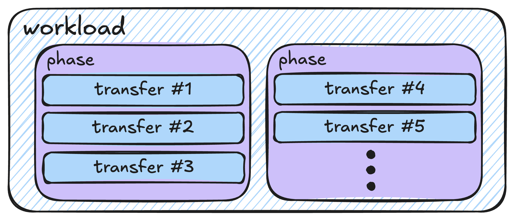

## tt-npe — Lightweight Network-on-Chip Performance Estimator

[](https://github.com/bgrady-tt/tt-npe/actions/workflows/build_and_test_ubuntu.yml)

> [!NOTE] 
> For now only pre-approved collaborators can pull this repo._ Please ask **bgrady-tt** for access!

### Build & Install

```shell
git clone git@github.com:bgrady-tt/tt-npe.git

cd tt-npe/ 
./build-noc-model.sh  # setup and run cmake 
```

Everything is installed to `tt-npe/install/`, including:
- Shared library (`install/lib/libtt_npe.so`)
- Headers C++ API (`install/include/`)
- Python CLI using pybind11 (`install/bin/tt_npe.py`)
- C++ CLI (`install/bin/tt_npe_run`)

### Unit Tests
tt-npe has two unit test suites; one for C++ code and one for Python.

##### Run All Tests

```
$ tt_npe/scripts/run_ut.sh # can be run from any pwd
```

### What tt-npe does 

tt-npe simulates the behavior of an abstract NoC "workload" running on a virtual Tenstorrent device. A workload corresponds closely to a trace of all calls to the dataflow_api (i.e. noc_async**). In fact, we can generate workloads directly from NoC traces extracted from real devices (support and documentation for doing this in tt-metal is in progress). 

tt-npe can work with both
- Predefined workloads defined in YAML files, potentially derived from real NoC traces
- Programmatically constructing a workload out of a `tt_npe::npeWorkload` data structure (`npe.Workload` in Python).

Some examples of workload files included in the repo can be found in:
- `tt-npe/tt_npe/workload/noc_trace_yaml_workloads/`

### Simulating Predefined Workloads Using tt_npe.py 

#### Environment Setup
Run the following to add tt-npe install dir to your `$PATH`:

```shell
cd tt-npe/ 
source ENV_SETUP # add <tt_npe_root>/install/bin/ to $PATH 
```

Now run the following:
```shell
tt_npe.py -w tt_npe/workload/example.yaml
```

**Note**: the `-w` argument is *required*, and specifies the YAML workload file to load.

##### Other Important Options

Bandwidth derating caused by congestion between concurrent transfers is modelled **by default**. Congestion modelling can be *disabled* using `--cong-model none`.

The `-e` option dumps detailed information about simulation timeline (e.g. congestion and transfer state for each timestep) into a JSON file located at `npe_stats.json` (by default). Future work is to load this data into a visualization tool, but it could be used for ad-hoc analysis as well.  

See `tt_npe.py --help` for more information about available options.

### Constructing Workloads Programmatically

tt-npe workloads are comprimised as collections of `Transfers`. Each `Transfer` represents a *series of back-to-back packets from one source to one or more destinations*. This is roughly equivalent to a single call to the dataflow APIs `noc_async_read` and `noc_async_write`.

`Transfers` are grouped *hierarchically* (see diagram). Each workload is a collection of `Phases`, and each `Phase` is a group of `Transfers`. 



__For most modelling scenarios, putting all `Transfers` in a single monolithic `Phase` is the correct approach__. The purpose of multiple `Phases` is to express data dependencies and synchronization common in real workloads. However full support for this is not yet complete.

##### *Example - Constructing a Random Workload using Python API*

See the example script `install/bin/programmatic_workload_generation.py`
for an annotated example of generating and simulating a tt-npe NoC workload via
Python bindings. 

### C++ API 
The C++ API requires: 
1. Including the header `install/include/npeAPI.hpp`
2. Linking to the shared lib `libtt_npe.so` 

##### Reference Example : C++ CLI (tt_npe_run)
See the example C++ based CLI source code within `tt-npe/tt_npe/cli/`. This links `libtt_npe.so` as a shared library, and serves as a reference for interacting with the API.

### Modelling Limitations

tt-npe **does not** currently model the following; features with a * are being prioritized.
- *Multicast NoC packets
- *Blackhole device support
- User defined data dependencies
- Ethernet
- Multichip traffic
